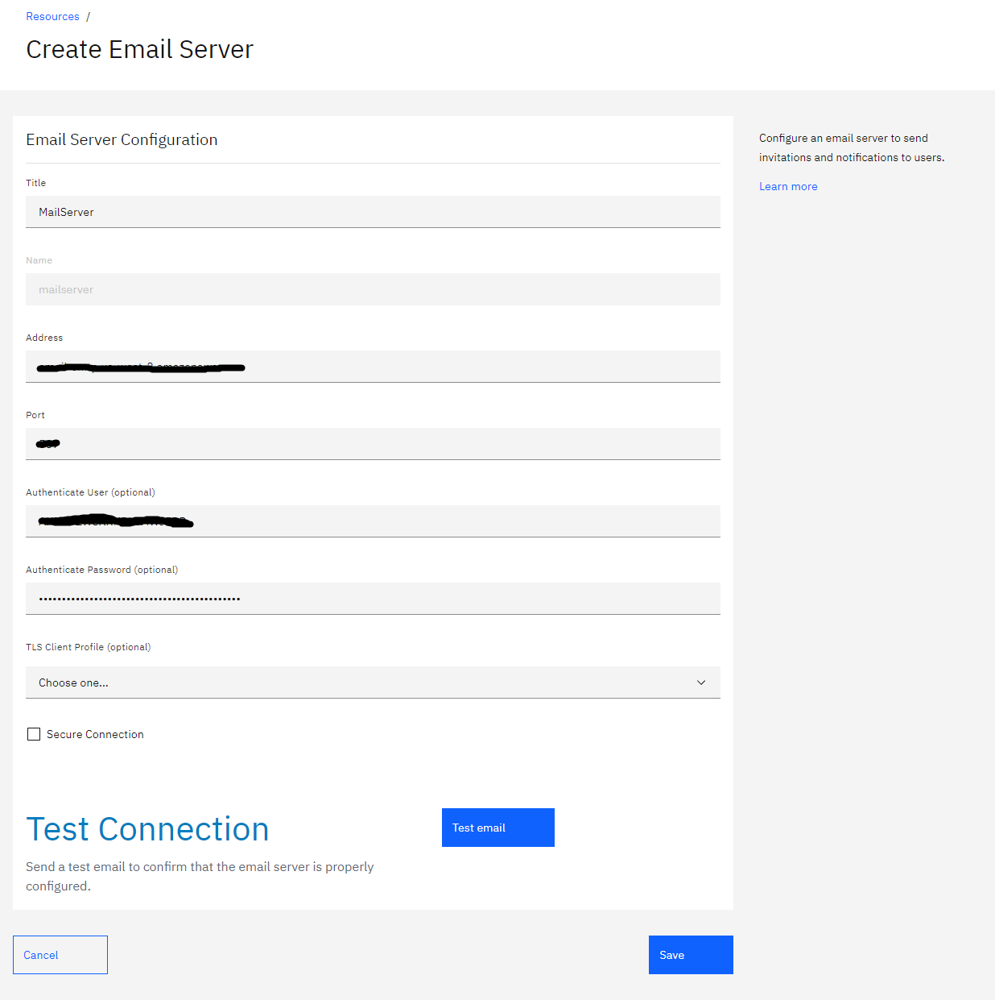
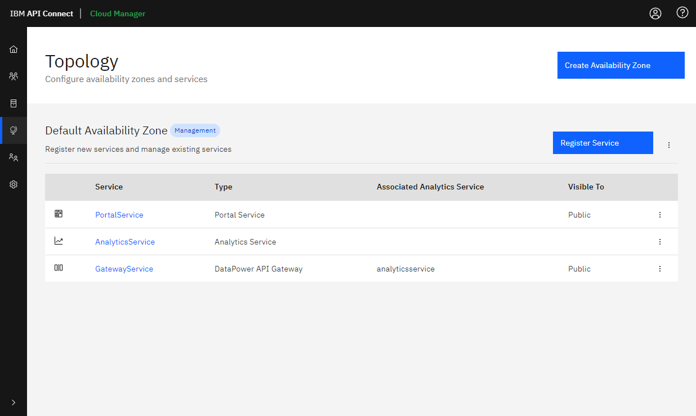

# Amazon EKSでの IBM API Connect v10のインストール

このガイドでは、 Aamazon EKS (以降 EKS ) 上での IBM API Connect (以降 APIC ) v10のインストールと構成の方法について説明します。  
内容は以下の通りです。

1. [当ガイドの前提条件](#1-当ガイドの前提条件)
2. [EKS の構成](#2-EKS-の構成)
3. [APIC のインストール](#3-APIC-のインストール)
4. [APIC サブシステムの構成](#4-APIC-サブシステムの構成)
5. [付録1 DataPower の WebGUI へのアクセス](#5-付録1-DataPower-の-WebGUI-へのアクセス)
6. [付録2 IBM License Service のインストール](#6-付録2-IBM-License-Service-のインストール)
7. [付録3 v10 における既知の問題と制約](#7-付録3-v10-における既知の問題と制約)

------------

## 1. 当ガイドの前提条件

当ガイドは、APIC ｖ10.0.0.0を前提としています。当ガイドの導入の前提条件は以下の通りです。

### 1-a )

3台のEC2インスタンス（ワーカー・ノード）を構成する

+ Instance Type: m5.8xlarge / Disk Size: 600GB
+ Kubernetesバージョン : 1.16  

### 1-b )

3 Availability Zone に構成する

### 1-c )

Boot ノードを1台構成する

+ Instance Type: m5.8xlarge / ディスク・サイズ: 100GB / OS: RHEL 8

### 1-d )

Docker レジストリーとして Amazon Elastic Container Registry (ECR )  を使用する

### 1-e )

メール・サーバーとして Amazon SES ( ASES ) を使用する

### 1-f )

Passport Advantage サイトからの以下のイメージをダウンロードしておく

+ apiconnect-image-tool-10.0.0.0.tar
+ IBM_API_CONNECT_OPERATOR_INSTALL_.zip

**注 :** IBM_API_CONNECT_OPERATOR_INSTALL_.zip には、カスタム・リソース ( CR ) テンプレートが含まれる helper_files.zip が含まれます。

### 1-g )

ワーカー・ノードで vm.max_map_map_count値を大きくしておく(推奨最小値 : 262144 )   

以下のリンクを参照してこの値を設定しておく


[https://www.ibm.com/support/knowledgecenter/en/SSMNED_v10/com.ibm.apic.install.doc/analytics_install_intro_k8s.html](https://www.ibm.com/support/knowledgecenter/en/SSMNED_v10/com.ibm.apic.install.doc/analytics_install_intro_k8s.html)


**注 :** 以下のダイアグラムは当ガイドの中で構成するトポロジーです。

 

----------------

## 2. EKS の構成

EKS を構成するには、以下のステップを実行します。

2-a )  Bootノードでのツール ( AWS CLI および kubectl ) の準備  
2-b )  IAM ロールのセットアップ  
2-c )  3つの Availability Zone を定義するための VPC のセットアップ  
2-d )  EKS クラスターの作成  
2-e )  3台のワーカー・ノードの追加  
2-f )  Amazon Elastic Container レジストリー ( ECR )  を Docker レジストリーとしてセットアップ  
2-g )  メール・サーバーとして Amazon SES ( ASES ) の構成を確認
2-h )  Amazon Route 53で、domain nameとrecord nameの設定を確認

------------

### 2-a )  Boot ノードでのツール ( AWS CLI および kubectl )  の準備

以下のドキュメントを参考にして、AWS CLI をインストールします。

[https://docs.aws.amazon.com/ja_jp/cli/latest/userguide/install-cliv2-linux.html](https://docs.aws.amazon.com/ja_jp/cli/latest/userguide/install-cliv2-linux.html)

AWS CLI のインストールが完了すると、以下のコマンド出力結果が得られます。

```
$ aws --version
aws-cli/2.0.22 Python/3.7.3 Linux/4.18.0-193.el8.x86_64 botocore/2.0.0dev26
```

以下のコマンドで AWS の接続情報を設定します。

```
$ aws configure
AWS Access Key ID [None]: <Your AWS Access Key ID>
AWS Secret Access Key [None]: <Your AWS Secret Access Key>
Default region name [None]: <Your Region Name>
Default output format [None]: <Output Format>
```

次のコマンドで Docker をインストールします。

```
$ sudo yum install docker
```

Docker のインストールが完了すると、以下のコマンド出力結果が得られます。

```
$ docker version
Version:            1.4.2-stable3
RemoteAPI Version:  1
Go Version:         go1.12.12
OS/Arch:            linux/amd64
```

以下のドキュメントを参照して、kubectl をインストールします。

[https://docs.aws.amazon.com/ja_jp/eks/latest/userguide/install-kubectl.html](https://docs.aws.amazon.com/ja_jp/eks/latest/userguide/install-kubectl.html)


kubectl のインストールが完了すると、以下のコマンド出力結果が得られます。

```
$ kubectl version --short --client
Client Version: v1.16.8-eks-e16311
```

### 2-b )  IAM ロールのセットアップ

EKS を管理するには、**AmazonEKSClusterPolicy** ポリシーを持つ IAM ロールをセットアップする必要があります。 **AmazonEKSClusterPolicy** ポリシーを設定するには、以下のドキュメントを参照してください。

[https://docs.aws.amazon.com/ja_jp/eks/latest/userguide/service_IAM_role.html](https://docs.aws.amazon.com/ja_jp/eks/latest/userguide/service_IAM_role.html)  

**AmazonEKSClusterPolicy** ポリシーが正しく構成されているかどうかを確認するには、 AWS 管理コンソールにログインしてから、**IAM > アクセス管理 > ポリシー** を選択してから、リストに **AmazonEKSClusterPolicy** ポリシーが表示されていることを確認してください。

### 2-c )  3つの Availability Zone を定義するための VPC のセットアップ

このガイドでは、3つの異なる Availability Zone ( ap-northeast-1a、ap-northeast-1c、ap-northeast-1d )  で実行される3つのワーカー・ノードがを構成します。Availability Zone を構成するには、VPC をセットアップする必要がありますが、VPC を構成するにはいくつか方法があります。

ここでは、1つの方法として、AWS CloudFormation コンソール上で VPC を構成するためのテンプレート・ファイルを準備します。これにより、VPC、サブネット、経路テーブル、インターネット・ゲートウェイ、 Elastic IP アドレス、 NAT ゲートウェイ、セキュリティー・グループを自動的に構成することができます。

AWS CloudFormation コンソール上での構成方法については、以下のドキュメントを参照してください。

[https://docs.aws.amazon.com/ja_jp/AWSCloudFormation/latest/UserGuide/cfn-console-create-stack.html](https://docs.aws.amazon.com/ja_jp/AWSCloudFormation/latest/UserGuide/cfn-console-create-stack.html)

VPC 構成用のサンプル・テンプレート・ファイルについては、以下のドキュメントを参照してください。

[https://docs.aws.amazon.com/ja_jp/codebuild/latest/userguide/cloudformation-vpc-template.html](https://docs.aws.amazon.com/ja_jp/codebuild/latest/userguide/cloudformation-vpc-template.html)

必要に応じて、以下のVPC 構成用のサンプル・テンプレート・ファイルを参考にしてください。このサンプルでは、以下のスニペットのように、Availability Zone を明示的に取得するための **GetAZs** 関数は定義していません。**GetAZs** 関数については以下のドキュメントを参照してください。

[https://docs.aws.amazon.com/AWSCloudFormation/latest/UserGuide/intrinsic-function-reference-getavailabilityzones.html](https://docs.aws.amazon.com/AWSCloudFormation/latest/UserGuide/intrinsic-function-reference-getavailabilityzones.html)

```
  PublicSubnet01:
    Type: AWS::EC2::Subnet
    Metadata:
      Comment: Subnet 01
    Properties:
      AvailabilityZone: ap-northeast-1a
      CidrBlock:
        Ref: PublicSubnet01Block
      VpcId:
        Ref: VPC
      Tags:
      - Key: Name
        Value: !Sub "${AWS::StackName}-PublicSubnet01"
```

### 2-d )  EKS クラスターの作成

EKS クラスターを作成するには、以下のドキュメントを参照してください。

[https://docs.aws.amazon.com/eks/latest/userguide/getting-started.html](https://docs.aws.amazon.com/eks/latest/userguide/getting-started.html)

EKS クラスターの構成後、以下のコマンドを実行して kubeconfig ファイルを更新します。

```
$ aws eks --region ap-northeast-1 update-kubeconfig --name eksqit
Added new context arn:aws:eks:ap-northeast-1:467519638150:cluster/eksqit to /home/ec2-user/.kube/config
```

**注 :** ここで、**eksqit** は EKS クラスターの名前を意味します。このパラメーターは構成に合わせて設定してください。

以下のコマンドを実行して、現在の kubeconfig ファイルが EKS クラスターに正しくマップされているかどうかを確認してください。  

```
$ kubectl config current-context
arn:aws:eks:ap-northeast-1:467519638150:cluster/eksqit
```

**cluster/EKS クラスター名** が正しく出力されている場合は、構成が正常に完了しています。このクラスターのデフォルト・サービスは以下のコマンドで確認できます。

 ```
 $ kubectl get svc
  NAME         TYPE        CLUSTER-IP   EXTERNAL-IP   PORT(S)   AGE
kubernetes   ClusterIP   10.100.0.1   <none>        443/TCP   15m
 ```

### 2-e )  3台のワーカー・ノードの追加

 ワーカー・ノードを追加するには、以下のドキュメントを参照してください。

[https://docs.aws.amazon.com/eks/latest/userguide/create-managed-node-group.html](https://docs.aws.amazon.com/eks/latest/userguide/create-managed-node-group.html)

### 2-f )  Amazon Elastic Container レジストリー ( ECR ) を Docker レジストリーとしてセットアップ

 このガイドでは、Amazon Elastic Container Registry ( ECR ) を Docker レジストリーとして使用します。APIC のイメージをプッシュする前に、ECR にログインできるかどうかを確認します。

```
$ aws ecr get-login --no-include-email
docker login -u AWS -p eyJwYXlsb2FkIjoiN0lHNy9xUXBWSCsxM3U0ZjVKeVJjVS8xdGhDeTNGSDFpWm82ekpzTW9Oc3lJeHM0TEEvWC8yRUVZcXlqNWZoamdDczBwdmtLN0ZFVERsUHJBemJGTndWTVNmTnJlNlgrWEozR3l3QTVWZjdUNGlVY0FZTUM0YWh4YjZ1blVXb2JSUHRWNmFLQ0lVT2NEYlMrbVUwQXhQYk1XRXRwUFk3L2RTWjkzMXVnS0FWbXFqdDJJdE5WZERMS2p1RkY1MDNWZGtxcyt6dG5aWGlKRGIxTDh1a1J6SmwvdlJLeWhnZWpzbVI2aG41RTlqNFdHeE54SU1ia2l0K3dwVHluVzJYY21hWU1yemZnc1lER3pGbFMvbW9QVVBFODd4ZzVDd21XbTV6cTdycHlKdi9qclB3N09vRzljNG9BUVJvUDZGQ0FreFZ1YTNXdHZZTVV4cWVZNlJSVXppL2M2ZTZSWGdFeHYxcWFKNzBUaWNqNG9pd3pJMG1MWXhWVG1mVVVtQVJZM3JyUXVLNDRWOWZ5a01WSGIwOHlsLzRYQnJzd2MyTHcyUVVsVEFNVDFaaFNHV1J4M0lybzdvY0QvQnJFNmNONEszeTZOcmxWOGx2U3N1THYvQXNraWVuN2lOR3loVG40U0l2UHpxWUpsY3p4UEVJcElybGMyUlp4Si96eHlFWm81Mml5QkhxcW9TQmZnN0xUM0JhQ29jZ3ZyN3VDMVBGdmVrMTAxZG5xaDlIN1ZyQTlKdHFzbTh5Y1FFaHVjTHRsV3BPcDBGSndPWG5zL1BKdGpIRS85V2RyNEVjMVNaZHI5WHNFd2dMNGRydHZMb2NYYU9mUlQ4Z2p3YjFWWFVjSE9wWVZvS25meHliWXk2NytFZno1NUxoVG1QZkJ0S3FlUUcveDZ5M21LNzljRHpLSkxQNDdzR0xTR01vK1RWNytMTHBOcnJsOW5SWHkzbFZNSWVqd0xTTTJ3MDVxcWJFRFlzYWJqRkVONjNOeEVvNTN4c0k5QUx2alJIZ1hHTGtyVVdtQ3pTWGp0RjFnY2JWczFIK25UbE9hY1J4ZUg1Q21iWVh4d0ZvNUZEeWJLRk96U296K01jL052NUVYVzRFa0NmMDFmY29YSTlVblRqcy9wZkViQ1JYeDVCNUFGZGJVZVQxOXR4bEkxSnZIeEQ3ajFCR3FqbmhLditYZWNvcFFWUWZ6d1poL3luT1VjbWNqeW5qaU0wTkFJMXVoeW1LbnJuZjhOa1BTVVFLUFpWVnU5TGpxTXdFMitXRjFzanJwTzMveElkZEt0V2M1TTBwZEtwYUtpOFpBcVl5ZkNNRjJKZlZBNE41NXBkUTdTRkpTRmtGa2loSGljZTJIbk5Kc3ZQMi9tdWdGdytRWDNwZlUzVHBINms1TzQwOHF1NHNwMHRXSXZNNEhZVHg4UVNVWDVKWmNHcFZyZThBaVhiSWQwVDJsUGNoQVV6L002U2pGK2xxdi81ZVJhTmFoZGJRWHlpTnNPM0RtenNEbXRuSDJFckhzSUxEanRRUUZLTFEvb1Z1cW5mNnNqQT09IiwiZGF0YWtleSI6IkFRRUJBSGdBTWZLRGxJb3BDNnpzMGJNZFJyWVNIYS9DMzlrQ3JjUDhrVnByRTlmK2tRQUFBSDR3ZkFZSktvWklodmNOQVFjR29HOHdiUUlCQURCb0Jna3Foa2lHOXcwQkJ3RXdIZ1lKWUlaSUFXVURCQUV1TUJFRURPbXFqcWxtZ0x0RC9sQVFOZ0lCRUlBNzFkdlVWaDYvTVlTSkdYYWpUc2czd2RBdXJnR1lLS2FWL0xvM1lJZStMTUVzQ2pkZGwxRXlxMzNMc2ttWDN6Z1NqVGY4Z3dlb2FBOXZzck09IiwidmVyc2lvbiI6IjIiLCJ0eXBlIjoiREFUQV9LRVkiLCJleHBpcmF0aW9uIjoxNTkwMTc0NzQ2fQ== https://467519638150.dkr.ecr.ap-northeast-1.amazonaws.com
```

上記の出力は、 ECR にログインするためのパスワードを示しているので、以下のようにログインすることができます。

```
$ docker login -u AWS -p eyJwYXlsb2FkIjoiN0lHNy9xUXBWSCsxM3U0ZjVKeVJjVS8xdGhDeTNGSDFpWm82ekpzTW9Oc3lJeHM0TEEvWC8yRUVZcXlqNWZoamdDczBwdmtLN0ZFVERsUHJBemJGTndWTVNmTnJlNlgrWEozR3l3QTVWZjdUNGlVY0FZTUM0YWh4YjZ1blVXb2JSUHRWNmFLQ0lVT2NEYlMrbVUwQXhQYk1XRXRwUFk3L2RTWjkzMXVnS0FWbXFqdDJJdE5WZERMS2p1RkY1MDNWZGtxcyt6dG5aWGlKRGIxTDh1a1J6SmwvdlJLeWhnZWpzbVI2aG41RTlqNFdHeE54SU1ia2l0K3dwVHluVzJYY21hWU1yemZnc1lER3pGbFMvbW9QVVBFODd4ZzVDd21XbTV6cTdycHlKdi9qclB3N09vRzljNG9BUVJvUDZGQ0FreFZ1YTNXdHZZTVV4cWVZNlJSVXppL2M2ZTZSWGdFeHYxcWFKNzBUaWNqNG9pd3pJMG1MWXhWVG1mVVVtQVJZM3JyUXVLNDRWOWZ5a01WSGIwOHlsLzRYQnJzd2MyTHcyUVVsVEFNVDFaaFNHV1J4M0lybzdvY0QvQnJFNmNONEszeTZOcmxWOGx2U3N1THYvQXNraWVuN2lOR3loVG40U0l2UHpxWUpsY3p4UEVJcElybGMyUlp4Si96eHlFWm81Mml5QkhxcW9TQmZnN0xUM0JhQ29jZ3ZyN3VDMVBGdmVrMTAxZG5xaDlIN1ZyQTlKdHFzbTh5Y1FFaHVjTHRsV3BPcDBGSndPWG5zL1BKdGpIRS85V2RyNEVjMVNaZHI5WHNFd2dMNGRydHZMb2NYYU9mUlQ4Z2p3YjFWWFVjSE9wWVZvS25meHliWXk2NytFZno1NUxoVG1QZkJ0S3FlUUcveDZ5M21LNzljRHpLSkxQNDdzR0xTR01vK1RWNytMTHBOcnJsOW5SWHkzbFZNSWVqd0xTTTJ3MDVxcWJFRFlzYWJqRkVONjNOeEVvNTN4c0k5QUx2alJIZ1hHTGtyVVdtQ3pTWGp0RjFnY2JWczFIK25UbE9hY1J4ZUg1Q21iWVh4d0ZvNUZEeWJLRk96U296K01jL052NUVYVzRFa0NmMDFmY29YSTlVblRqcy9wZkViQ1JYeDVCNUFGZGJVZVQxOXR4bEkxSnZIeEQ3ajFCR3FqbmhLditYZWNvcFFWUWZ6d1poL3luT1VjbWNqeW5qaU0wTkFJMXVoeW1LbnJuZjhOa1BTVVFLUFpWVnU5TGpxTXdFMitXRjFzanJwTzMveElkZEt0V2M1TTBwZEtwYUtpOFpBcVl5ZkNNRjJKZlZBNE41NXBkUTdTRkpTRmtGa2loSGljZTJIbk5Kc3ZQMi9tdWdGdytRWDNwZlUzVHBINms1TzQwOHF1NHNwMHRXSXZNNEhZVHg4UVNVWDVKWmNHcFZyZThBaVhiSWQwVDJsUGNoQVV6L002U2pGK2xxdi81ZVJhTmFoZGJRWHlpTnNPM0RtenNEbXRuSDJFckhzSUxEanRRUUZLTFEvb1Z1cW5mNnNqQT09IiwiZGF0YWtleSI6IkFRRUJBSGdBTWZLRGxJb3BDNnpzMGJNZFJyWVNIYS9DMzlrQ3JjUDhrVnByRTlmK2tRQUFBSDR3ZkFZSktvWklodmNOQVFjR29HOHdiUUlCQURCb0Jna3Foa2lHOXcwQkJ3RXdIZ1lKWUlaSUFXVURCQUV1TUJFRURPbXFqcWxtZ0x0RC9sQVFOZ0lCRUlBNzFkdlVWaDYvTVlTSkdYYWpUc2czd2RBdXJnR1lLS2FWL0xvM1lJZStMTUVzQ2pkZGwxRXlxMzNMc2ttWDN6Z1NqVGY4Z3dlb2FBOXZzck09IiwidmVyc2lvbiI6IjIiLCJ0eXBlIjoiREFUQV9LRVkiLCJleHBpcmF0aW9uIjoxNTkwMTc0NzQ2fQ== https://467519638150.dkr.ecr.ap-northeast-1.amazonaws.com

WARNING! Using --password via the CLI is insecure. Use --password-stdin.
Login Succeeded
```

### 2-g )  メール・サーバーとして Amazon SES ( ASES ) の構成を確認

このガイドでは、 Amazon SES ( ASES ) をメール・サーバーとして使用します。 API Manager を構成する際に、 CMC 上のメール・サーバーに関する情報を設定するため、事前にこのサーバー名とポート番号を確認しておきます。 コンソールで **SES ホーム > SMTP 設定** にアクセスすると、これらの情報を確認できます。

### 2-h )  Amazon Route 53で、domain nameとrecord nameの設定を確認

APIC用のエンドポイントを構成します。このガイドでは、domain nameとrecord nameをAmazon Route 53で定義します。例えば、CMC用のエンドポイントとして、"admin.iks-dl.com"を設定します。この場合、"admin.iks-dl.com" は record name として定義します。wildcard entry ( *.iks-dl.com ) を使う場合は、すべてのホスト名を個別に定義する必要はありません。

----------

## 3. APIC のインストール

以下のステップを実行してAPIC をインストールします。

3-a )  APIC の Docker イメージの Push

3-b )  Ingress Controller のインストール

3-c )  Kubernetes オペレーターのインストール

3-d )  cert-manager と証明書のインストール  

3-e )  APIC サブシステムのインストール

---------

### 3-a )  APIC の Docker イメージの Push

Boot ノードで image-tool イメージ ( apiconnect-image-tool-10.0.0.0.tar.gz ) をコピーしてロードします。


```
$ docker load < apiconnect-image-tool-10.0.0.0.tar.gz
Getting image source signatures
Copying blob d791d99e4520 done
Copying blob ac7577b8c383 done
Copying blob 5601485f0109 done
Copying blob 3a807c9cf098 done
Copying blob 062ad2dd3420 done
Copying blob 4c9d605ce1a8 done
Copying blob 250f016d213d done
Copying blob 1fdbe8fa4590 done
Copying config 33a62f20b2 done
Writing manifest to image destination
Storing signatures
Loaded image(s): localhost/apiconnect-image-tool-10.0.0.0:latest
```

イメージの名前とタグを確認します。

```
$ docker run --rm apiconnect-image-tool-10.0.0.0 version  --images
---
- datapower-operator:1.0.0
- ibm-apiconnect-analytics-analytics-client:2020-06-06-14-44-38-2c56946-v10
- ibm-apiconnect-analytics-analytics-cronjobs:2020-06-06-09-19-47-32b9d94-v10
- ibm-apiconnect-analytics-analytics-ingestion:2020-06-07-23-54-14-c5f16b2-v10
- ibm-apiconnect-analytics-analytics-mq-kafka:2020-06-06-09-20-46-73f02f4-v10
- ibm-apiconnect-analytics-analytics-mq-zookeeper:2020-06-06-09-21-20-0acbb88-v10
- ibm-apiconnect-analytics-analytics-mtls:2020-06-06-09-21-50-e5640d8-v10
- ibm-apiconnect-analytics-analytics-storage:2020-06-07-23-54-24-41a4a75-v10
- ibm-apiconnect-catalog:olm.1.0.0.op.0.0.1.g.fdf37c3.b.v1000.n.713.t.1591903154
- ibm-apiconnect-gateway-datapower-nonprod:10.0.0.0.321933
- ibm-apiconnect-gateway-datapower-prod:10.0.0.0.321933
- ibm-apiconnect-gateway-k8s-datapower-monitor:(rel)-1-0-0-branch-2-b2078ca
- ibm-apiconnect-management-analytics-proxy:2020-06-06-09-22-39-5db7af1-v10
- ibm-apiconnect-management-apim:v10.0.0-126-41a2743
- ibm-apiconnect-management-client-downloads-server:2020-06-05-03-10-47-v10.0.0-0-g94ac1c3
- ibm-apiconnect-management-crunchy-pgbadger:ubi7-12.3-4.3.1
- ibm-apiconnect-management-crunchy-pgbouncer:ubi7-12.3-4.3.1
- ibm-apiconnect-management-crunchy-postgres-ha:ubi7-12.3-4.3.1
- ibm-apiconnect-management-hub:V10.0.0-20200611-150657
- ibm-apiconnect-management-juhu:2020-06-04-13-09-30-v10.0.0-0-g3e7e7dc
- ibm-apiconnect-management-k8s-init:g.06a0d06891a7c9e03531985c6bea61c5bc954121.b.v10.0.0.n.169
- ibm-apiconnect-management-ldap:V10.0.0-70-f2b772d
- ibm-apiconnect-management-lur:V10.0.0-76-edb6d77
- ibm-apiconnect-management-nats-operator:4-2020-06-03-13-14-07-b668316ce38247181ce4c90b9f4434c778b5158c
- ibm-apiconnect-management-nats-server:3-2020-06-03-13-14-53-3c6778982a07be5e6d9eb8df567d566379e71e8e
- ibm-apiconnect-management-nats-streaming-operator:4-2020-06-03-13-14-31-e9dee3c93646cad2a93f1c457a1fcb16ee70904f
- ibm-apiconnect-management-nats-streaming-server:3-2020-06-03-13-15-15-4723e954792bbe7f58382c554a3f1a11d2c13231
- ibm-apiconnect-management-pgo-apiserver:ubi7-4.3.1
- ibm-apiconnect-management-pgo-backrest:ubi7-4.3.1
- ibm-apiconnect-management-pgo-backrest-repo:ubi7-4.3.1
- ibm-apiconnect-management-pgo-backrest-restore:ubi7-4.3.1
- ibm-apiconnect-management-pgo-client:ubi7-4.3.1
- ibm-apiconnect-management-pgo-event:ubi7-4.3.1
- ibm-apiconnect-management-pgo-rmdata:ubi7-4.3.1
- ibm-apiconnect-management-pgo-scheduler:ubi7-4.3.1
- ibm-apiconnect-management-portal-proxy:2020-06-07-12-16-19-v10.0.0-0-gd7777c6
- ibm-apiconnect-management-postgres-operator:ubi7-4.3.1
- ibm-apiconnect-management-task-manager:v10.0.0-126-41a2743
- ibm-apiconnect-management-turnstile:V10.0.0-20200606-84124
- ibm-apiconnect-management-ui:V10.0.0-53-b21a3821cdee55339dd2ef55d5cfe62a72f76570
- ibm-apiconnect-management-V10-upgrade:V10.0.0-197-EXTRACT
- ibm-apiconnect-management-V10-upgrade:V10.0.0-197-LOAD
- ibm-apiconnect-management-ws-tunnel:olm..g.aa0b7a9.b.v1000.n.5.t.1591236229
- ibm-apiconnect-operator:olm.1.0.0.op.0.0.1.g.fdf37c3.b.v1000.n.713.t.1591903154
- ibm-apiconnect-operator-bundle:olm.1.0.0.op.0.0.1.g.fdf37c3.b.v1000.n.713.t.1591903154
- ibm-apiconnect-portal-k8s-init:g.06a0d06891a7c9e03531985c6bea61c5bc954121.b.v10.0.0.n.169
- ibm-apiconnect-portal-openresty:g.5a7da6e28f25b095f3a5c86196169063705a0142.b.v10.0.0.n.166
- ibm-apiconnect-portal-portal-admin:v10.0.0-9343e459eb5f8df354bfca4a3bf78df35d979b8e-159
- ibm-apiconnect-portal-portal-db:v10.0.0-8eaa3a8904cea5aad8660be00ad47d3c7089c472-49
- ibm-apiconnect-portal-portal-dbproxy:v10.0.0-8eaa3a8904cea5aad8660be00ad47d3c7089c472-49
- ibm-apiconnect-portal-portal-web:v10.0.0-9343e459eb5f8df354bfca4a3bf78df35d979b8e-159
- ibm-apiconnect-portal-ws-tunnel:olm..g.aa0b7a9.b.v1000.n.5.t.1591236229
```

ECR を Docker レジストリーとして使用する場合は、上記のすべての APIC イメージに対して手動でリポジトリーを作成する必要があります。 これは、aws コマンドの実行、または、ECR コンソールから実行できます。 aws コマンドで実施する場合は、以下のサンプル・スニペットを参考にしてください。

```
$ aws ecr create-repository --repository-name datapower-operator
{
    "repository": {
        "repositoryArn": "arn:aws:ecr:ap-northeast-1:467519638150:repository/datapower-operator",
        "registryId": "467519638150",
        "repositoryName": "datapower-operator",
        "repositoryUri": "467519638150.dkr.ecr.ap-northeast-1.amazonaws.com/datapower-operator",
        "createdAt": "2020-06-17T04:47:31+00:00",
        "imageTagMutability": "MUTABLE",
        "imageScanningConfiguration": {
            "scanOnPush": false
        }
    }
}
```

image-tool イメージを ECR にプッシュします。以下の例で、 **467519638150.dkr.ecr.ap-northeast-1.amazonaws.com** はリポジトリーの URI であり、**aws ecr create-repository** コマンドの出力結果の **repositoryUri** の値から "/リポジトリー名" を削除したものです。

```
$ docker run --rm apiconnect-image-tool-10.0.0.0 upload 467519638150.dkr.ecr.ap-northeast-1.amazonaws.com --username AWS --password $(aws ecr get-login-password)
time="2020-06-17T07:04:56Z" level=info msg="uploading datapower-operator:1.0.0"
Getting image source signatures
Copying blob sha256:8d420cfaafb5a490c6fd332e4bd8d40e7dd051bd298ea9b96966025f939cdd71
Copying blob sha256:7d4a479178ab3b4da5c293821561e804a5d9ea05e17f669b26a6a9bb5b2a218e
Copying blob sha256:383faa21ff8191c67eb1cd6e7e23f6455a54ffc4b83d8fd2afa27ef043bf66af
Copying blob sha256:7852f6f21676c4f130345e7a09e2190e4e4b33d8a68dd3f6b9225057b5ea96cd
Copying blob sha256:116e4db553f0a7e86886acd247db43febdce52ee2797257e07dfdc2004d20b38
Copying blob sha256:de4e505d7fb29653d46cc24b59654f0b6ea731bfd350de365bf44d1173f63dad
Copying blob sha256:b1460fa1f83a42bea40748890388e19d8a33dfc639391254aecdcc2b0a915128
Copying blob sha256:d5f9ac177fd4c6b82a74c5d8f30592c9aafcc8064ff79dddc532d786c8e57691
Copying blob sha256:0424aac3e99ffd42b24a98483834e7fac33371f3220ce645761d648a9cb13750
Copying config sha256:26491f62031693d01385ab26e9c271c32825a0f535984d9dcb8bda77ea6688e4
Writing manifest to image destination
Storing signatures
time="2020-06-17T07:04:56Z" level=info msg="uploading ibm-apiconnect-analytics-analytics-client:2020-06-06-14-44-38-2c56946-v10"
Getting image source signatures
Copying blob sha256:fcd63ccfdd0ccd78cc0b23a6e9cef0c400625c1506f3eed694d92c7ced04b4c4
Copying blob sha256:09dbbf8834d2d84d8d8a37dcf7d6049794c9c8c604a3d3f2606768a82771438d
Copying blob sha256:3409ce05d285b40bd58ad0fff17db01f42814b1b1e85ef529fdf6ac2c54521af
Copying blob sha256:69c379411c00b6e181524d107bb3e9a53a161968c2668738f8fea4d9799580c7
Copying blob sha256:d6c73223c2552cbe6e854a6b73c6aba5866f74882ce3809027b1686efaaed060
Copying blob sha256:468a8c7dc4b3dde2b35790f59e7fa1f21b06cc209905a8da7f770ab4501fa172
Copying blob sha256:7c84777a02e1c32f49945716abde83fb703908968830ed1862a683d510afaaa6
Copying blob sha256:8343dfee104586de1c99a5f64f9a1abfd5379710375334d7699933106b6c58b8
Copying blob sha256:817ea51462009f3bfbf3690b7cb5c1b3762432cce46051bca018c4b91bec6a4b
Copying blob sha256:419dcf1e797961a29e903c2c58ef71cf9dca70f5833dbe34c1298a9e1d036ca0
Copying blob sha256:f70469d8e6a1a152c82a806e470f3d3af9318a6a267269ab5052890e0a26f033
Copying blob sha256:f1291675dcbd52cc9c0b87e3a3d888dea52d8d356f78ce8e6754566d18b74db2
Copying blob sha256:9a35c89d197db25cd63c62f547f7bbbce82900bede6e84499d5268dc4f18102c
Copying blob sha256:03086c3c9181df5926e77d47485529a60293c50ee5c3e416b732fc684947c8a0
Copying blob sha256:c9984d8d6188f2a24b073c7791e81bf09f398cd81c50aa402bdb1e4f14d1f001
Copying blob sha256:294d02c0339fcc992909850726101782845a311e196fa5646565e75c4903f206
Copying blob sha256:923a05eb5a8547518c4f6cf3118b80927109b06a2edb2a638a790232676a536c
Copying blob sha256:267eda31382b1eff1cf375552bf656258793f7d3efc043e964c8a37a5beff0ab
Copying blob sha256:217a502ac021a58861f73750a023bee88ecce461ccd5fd491ad8b786fed6bb39
Copying blob sha256:105c046fad603755226ebb108583d894a308341d62165233233619659604c498
Copying config sha256:0fabad776d5963aaaa943f78354059d91fd6ebc6b2ba0a104ad0fbef1c9eacc3
...
Writing manifest to image destination
Storing signatures
time="2020-06-17T07:19:29Z" level=info msg="uploading ibm-apiconnect-portal-ws-tunnel:olm..g.aa0b7a9.b.v1000.n.5.t.1591236229"
Getting image source signatures
Copying blob sha256:fcd63ccfdd0ccd78cc0b23a6e9cef0c400625c1506f3eed694d92c7ced04b4c4
Copying blob sha256:09dbbf8834d2d84d8d8a37dcf7d6049794c9c8c604a3d3f2606768a82771438d
Copying blob sha256:655f4aec4ffa0aac160183a7c71c70de2d1e19c9fd0ce4167df59b55df919710
Copying blob sha256:f4b575d19f6d2d55bc6bd4234f9eb5aa366ee8f2d1fe6bc3a3bd58d47d4e2045
Copying blob sha256:fecb363e4653d949c9466a5294983353fa6012ba5a386b9246f614f85b75ae8e
Copying blob sha256:3fcd9e6e8202b8101dc54c132d9b7c9883f62da263710aaf67b92fd33c4c7c5d
Copying blob sha256:e67a0115ff9afdf13709a91a136d71fa418b11fb9a6ff7e9384426bd2595aeeb
Copying blob sha256:e67a0115ff9afdf13709a91a136d71fa418b11fb9a6ff7e9384426bd2595aeeb
Copying config sha256:9d2fd1e380ebde84a3f3709a04248a3009bdd1e9a5a85213e36aa3cbee86b0cf
Writing manifest to image destination
Storing signatures
```

上記のコマンドが完了したら、以下のコマンドでイメージのリストを確認してください。

```
$ docker images
REPOSITORY                                 TAG      IMAGE ID       CREATED       SIZE
localhost/apiconnect-image-tool-10.0.0.0   latest   33a62f20b2ac   6 weeks ago   7.37 GB
```

### 3-b )  Ingress Controller のインストール

以下のガイドを参照して Ingress Controller をインストールします。

[https://www.ibm.com/support/knowledgecenter/en/SSMNED_v10/com.ibm.apic.install.doc/tapic_install_K8s_ingress_ctl_reqs.html](https://www.ibm.com/support/knowledgecenter/en/SSMNED_v10/com.ibm.apic.install.doc/tapic_install_K8s_ingress_ctl_reqs.html)


helm コマンドが完了すると、 3つの Ingress Controller の Pod ( ingress-nginx-ingress-controller-xxx ) が構成されていることが確認できます。

```
$ kubectl get pod -n kube-system
NAME                                                    READY   STATUS    RESTARTS   AGE
aws-node-548hx                                          1/1     Running   0          22d
aws-node-5qsrw                                          1/1     Running   0          22d
aws-node-bngbf                                          1/1     Running   0          22d
coredns-75b44cb5b4-mrwms                                1/1     Running   0          22d
coredns-75b44cb5b4-n8gzg                                1/1     Running   0          22d
ingress-nginx-ingress-controller-jcnr2                  1/1     Running   0          20d
ingress-nginx-ingress-controller-k6tgw                  1/1     Running   0          20d
ingress-nginx-ingress-controller-nlkjb                  1/1     Running   0          20d
ingress-nginx-ingress-default-backend-cb576588c-mdwq5   1/1     Running   0          20d
kube-proxy-4q44s                                        1/1     Running   0          22d
kube-proxy-gtsg5                                        1/1     Running   0          22d
kube-proxy-njrb7                                        1/1     Running   0          22d
```

また、この時点でNLB が自動的に作成されます。AWSコンソールの "LoadBalancer" メニューから、NLB が構成されており、ステータスが Active となっていることを確認できます。

   

ここで、このNLBに対するDNS nameを確認します。このDNS nameは、Amazon Route 53のレコード名のTraffic Routing として設定されていなければなりません。

上記の Knowledge Center のガイドに記述されているとおり、**proxy-read-timeout** および **proxy-send-timeout** 値を 240に増やすことをお勧めします。 ConfigMap (今回は ingress-nginx-controller ) を変更して、Ingress Controller の Pod を再起動します。

```
$ kubectl -n ingress-nginx edit cm ingress-nginx-controller -o yaml
apiVersion: v1
data:
  proxy-read-timeout: "240"
  proxy-send-timeout: "240"
```  

**注 ：** この手順の後、2つのデフォルトの action ( TCP: 80 および TCP: 443 ) を、 ingress-nginx-ingress-controller サービスで定義されたポート ( HTTP / HTTPS ) を持つ新しいターゲット・グループに置き換える必要があります。 最初に、 ingress-nginx-ingress-controller サービスでどのポートが listen されているか確認します。

```
$ kubectl get svc -n kube-system
NAME                                    TYPE           CLUSTER-IP       EXTERNAL-IP                                                                     PORT(S)                      AGE
ingress-nginx-ingress-controller        LoadBalancer   172.20.7.58      a30d3df93fa7c44aeab1786e46cfa9a1-1e8f62f7b81650ee.elb.us-east-1.amazonaws.com   80:30278/TCP,443:31290/TCP   29d
ingress-nginx-ingress-default-backend   ClusterIP      172.20.169.101   <none>                                                                          80/TCP                       29d
kube-dns                                ClusterIP      172.20.0.10      <none>                                                                          53/UDP,53/TCP                32d
```

この例では、30278 ( HTTPの場合 ) および 31290 ( HTTPSの場合 ) が listen されています。 これらのポートについて、新規に2つのターゲット・グループを定義します。30178ポートのターゲット・グループを定義する例は以下の通りです。


AWSコンソールで、**Loadbalancing** > **Target Group** セクションに進み、**Create target group** をクリックします。

   

**IP addresses** を選択し、Target group name、Port (Protocol は TCP ) 、VPCを設定します。

   

3 つのワーカー・ノードのプライベート IP を確認します。これらのノードを Targets に追加します。

   

新規 Target group が表示されます。  

   

2つの Target group の作成が完了したら、 NLB の **Listener** タブにアクセスして、これらの Target group を追加してください。 (デフォルトの Target group は削除します。)  

### 3-c )  Kubernetesオペレーターのインストール

APIC をデフォルト以外の namespace にデプロイしたい場合には、新たに namespace を作成して APIC をデプロイします。このガイドでは、**apic** という名前の namespace を作成します。

```
$ kubectl create ns apic
namespace/apic created
```

アップロードされた製品イメージを pull する registry secret を作成します。

```
$ kubectl -n apic create secret docker-registry apic-registry-secret --docker-server=467519638150.dkr.ecr.ap-northeast-1.amazonaws.com --docker-username=AWS --docker-password=$(aws ecr get-login-password) --docker-email=unused
secret/apic-registry-secret created
```

DataPower のイメージを pull する DataPower レジストリー用の registry secret を作成します。

```
$ kubectl -n apic create secret docker-registry datapower-docker-local-cred --docker-server=467519638150.dkr.ecr.ap-northeast-1.amazonaws.com --docker-username=AWS --docker-password=$(aws ecr get-login-password) --docker-email=unused
secret/datapower-docker-local-cred created
```

DataPower の WebGUI にアクセスする必要がある場合は、WebGUI にアクセスするための DataPower の admin secret を作成してください。

```
$ kubectl -n apic create secret generic datapower-admin-credentials --from-literal=password=admin
secret/datapower-admin-credentials created
```

イメージ名を置換するには、 ibm-apiconnect.yaml および ibm-datapower.yaml を変更します。 ( namespace がデフォルトでない場合は、合わせて変更します)。 必要に応じて ibm-apiconnect.yaml および ibm-datapower.yaml について [カスタム・リソース (CR) テンプレート](https://github.com/cp4i-jp/apicv10-installation-eks-jp/tree/master/sample/cr) を参照してください。

次に CRD をインストールしします。 ( ibm-apiconnect-crds.yaml は変更されていません。)

```
$ kubectl apply -f ibm-apiconnect-crds.yaml
customresourcedefinition.apiextensions.k8s.io/analyticsbackups.analytics.apiconnect.ibm.com created
customresourcedefinition.apiextensions.k8s.io/analyticsclusters.analytics.apiconnect.ibm.com created
customresourcedefinition.apiextensions.k8s.io/analyticsrestores.analytics.apiconnect.ibm.com created
customresourcedefinition.apiextensions.k8s.io/pgclusters.crunchydata.com created
customresourcedefinition.apiextensions.k8s.io/pgpolicies.crunchydata.com created
customresourcedefinition.apiextensions.k8s.io/pgreplicas.crunchydata.com created
customresourcedefinition.apiextensions.k8s.io/pgtasks.crunchydata.com created
customresourcedefinition.apiextensions.k8s.io/gatewayclusters.gateway.apiconnect.ibm.com created
customresourcedefinition.apiextensions.k8s.io/managementbackups.management.apiconnect.ibm.com created
customresourcedefinition.apiextensions.k8s.io/managementclusters.management.apiconnect.ibm.com created
customresourcedefinition.apiextensions.k8s.io/managementrestores.management.apiconnect.ibm.com created
customresourcedefinition.apiextensions.k8s.io/natsclusters.nats.io created
customresourcedefinition.apiextensions.k8s.io/natsserviceroles.nats.io created
customresourcedefinition.apiextensions.k8s.io/portalbackups.portal.apiconnect.ibm.com created
customresourcedefinition.apiextensions.k8s.io/portalclusters.portal.apiconnect.ibm.com created
customresourcedefinition.apiextensions.k8s.io/portalrestores.portal.apiconnect.ibm.com created
customresourcedefinition.apiextensions.k8s.io/natsstreamingclusters.streaming.nats.io created
customresourcedefinition.apiextensions.k8s.io/datapowerservices.datapower.ibm.com created
```

ibm-apiconnect オペレーター Pod をインストールします。

```
$ kubectl apply -f ibm-apiconnect.yaml
deployment.apps/ibm-apiconnect created
clusterrole.rbac.authorization.k8s.io/ibm-apiconnect created
clusterrolebinding.rbac.authorization.k8s.io/ibm-apiconnect-apic created
role.rbac.authorization.k8s.io/ibm-apiconnect created
rolebinding.rbac.authorization.k8s.io/ibm-apiconnect created
serviceaccount/ibm-apiconnect created
```

datapower-operator Pod をインストールします。

```
$ kubectl apply -f ibm-datapower.yaml -n apic
serviceaccount/datapower-operator created
clusterrole.rbac.authorization.k8s.io/datapower-operator created
clusterrolebinding.rbac.authorization.k8s.io/datapower-operator created
deployment.apps/datapower-operator created
```

この時点で、 以下のように2つの Pod が実行していることを確認します。

```
$ kubectl get all -n apic
NAME                                      READY   STATUS    RESTARTS   AGE
pod/datapower-operator-7dc6f49c75-hg9k4   1/1     Running   0          12m
pod/ibm-apiconnect-d57556555-qhk4f        1/1     Running   0          5h15m
```

### 3-d )  cert-manager と証明書のインストール

namespace を指定せずに cert-manager-0.10.1.yaml を apply します。

```
$ kubectl apply -f cert-manager-0.10.1.yaml --validate=false
customresourcedefinition.apiextensions.k8s.io/certificaterequests.certmanager.k8s.io created
customresourcedefinition.apiextensions.k8s.io/certificates.certmanager.k8s.io created
customresourcedefinition.apiextensions.k8s.io/challenges.certmanager.k8s.io created
customresourcedefinition.apiextensions.k8s.io/clusterissuers.certmanager.k8s.io created
customresourcedefinition.apiextensions.k8s.io/issuers.certmanager.k8s.io created
customresourcedefinition.apiextensions.k8s.io/orders.certmanager.k8s.io created
namespace/cert-manager created
serviceaccount/cert-manager-cainjector created
serviceaccount/cert-manager created
serviceaccount/cert-manager-webhook created
clusterrole.rbac.authorization.k8s.io/cert-manager-cainjector created
clusterrolebinding.rbac.authorization.k8s.io/cert-manager-cainjector created
clusterrole.rbac.authorization.k8s.io/cert-manager-leaderelection created
clusterrole.rbac.authorization.k8s.io/cert-manager-controller-issuers created
clusterrole.rbac.authorization.k8s.io/cert-manager-controller-clusterissuers created
clusterrole.rbac.authorization.k8s.io/cert-manager-controller-certificates created
clusterrole.rbac.authorization.k8s.io/cert-manager-controller-orders created
clusterrole.rbac.authorization.k8s.io/cert-manager-controller-challenges created
clusterrole.rbac.authorization.k8s.io/cert-manager-controller-ingress-shim created
clusterrolebinding.rbac.authorization.k8s.io/cert-manager-leaderelection created
clusterrolebinding.rbac.authorization.k8s.io/cert-manager-controller-issuers created
clusterrolebinding.rbac.authorization.k8s.io/cert-manager-controller-clusterissuers created
clusterrolebinding.rbac.authorization.k8s.io/cert-manager-controller-certificates created
clusterrolebinding.rbac.authorization.k8s.io/cert-manager-controller-orders created
clusterrolebinding.rbac.authorization.k8s.io/cert-manager-controller-challenges created
clusterrolebinding.rbac.authorization.k8s.io/cert-manager-controller-ingress-shim created
clusterrole.rbac.authorization.k8s.io/cert-manager-view created
clusterrole.rbac.authorization.k8s.io/cert-manager-edit created
clusterrolebinding.rbac.authorization.k8s.io/cert-manager-webhook:auth-delegator created
rolebinding.rbac.authorization.k8s.io/cert-manager-webhook:webhook-authentication-reader created
clusterrole.rbac.authorization.k8s.io/cert-manager-webhook:webhook-requester created
service/cert-manager created
service/cert-manager-webhook created
deployment.apps/cert-manager-cainjector created
deployment.apps/cert-manager created
deployment.apps/cert-manager-webhook created
apiservice.apiregistration.k8s.io/v1beta1.webhook.certmanager.k8s.io created
mutatingwebhookconfiguration.admissionregistration.k8s.io/cert-manager-webhook created
validatingwebhookconfiguration.admissionregistration.k8s.io/cert-manager-webhook created
```

この時点で、以下のように3つの Pod が実行されていることを確認します。

```
$ kubectl get pod -n cert-manager							
NAME                                      READY   STATUS    RESTARTS   AGE							
cert-manager-64cc76f84d-dq6n6             1/1     Running   0          59s							
cert-manager-cainjector-c9855769f-qrgrm   1/1     Running   0          59s							
cert-manager-webhook-7c6f9dfd8b-728qx     1/1     Running   1          59s
```

ingress-issuer-v1-alpha1.yaml を apply します。

```
$ kubectl apply -f ingress-issuer-v1-alpha1.yaml -n apic								
issuer.certmanager.k8s.io/selfsigning-issuer created								
certificate.certmanager.k8s.io/ingress-ca created								
issuer.certmanager.k8s.io/ingress-issuer created								
certificate.certmanager.k8s.io/portal-admin-client created								
certificate.certmanager.k8s.io/analytics-client-client created								
certificate.certmanager.k8s.io/analytics-ingestion-client created								
certificate.certmanager.k8s.io/gateway-service created								
certificate.certmanager.k8s.io/gateway-peering created								
```

以下のようにすべての証明書が **True** であることを確認します。

```
$ kubectl get certificates -n apic						
NAME                         READY   SECRET                       AGE						
analytics-client-client      True    analytics-client-client      58s						
analytics-ingestion-client   True    analytics-ingestion-client   58s						
gateway-peering              True    gateway-peering              58s						
gateway-service              True    gateway-service              58s						
ingress-ca                   True    ingress-ca                   58s						
portal-admin-client          True    portal-admin-client          58s						
```

### 3-e )  APIC サブシステムのインストール

APIC サブシステムのカスタム・リソース ( CR ) を事前に変更してから、CR を apply します。基本的なチュートリアルについては、 以下の Knowledge Center のガイドを参照してください。

[https://www.ibm.com/support/knowledgecenter/en/SSMNED_v10/com.ibm.apic.install.doc/tapic_v10_install_kubernetes_subsys.html](https://www.ibm.com/support/knowledgecenter/en/SSMNED_v10/com.ibm.apic.install.doc/tapic_v10_install_kubernetes_subsys.html)

**注 :** 必要に応じて、各サブシステムの [カスタム・リソース (CR) テンプレート](https://github.com/cp4i-jp/apicv10-installation-eks-jp/tree/master/sample/cr) を参照してください。

次に、Management サブシステムの CR を apply します。

```
$ kubectl apply -f management_cr.yaml -n apic
managementcluster.management.apiconnect.ibm.com/management created
```

インストールが問題なく完了すると、以下のコマンドの出力結果で READY 欄に **True** が表示されます。

```
$ kubectl get ManagementCluster -n apic
NAME         READY   SUMMARY   VERSION    RECONCILED VERSION   AGE
management   True    14/14     10.0.0.0   10.0.0.0-713         7m14s
```

portal サブシステムの CR を apply します。

```
$ kubectl apply -f portal_cr.yaml -n apic
portalcluster.portal.apiconnect.ibm.com/portal created
```

インストールが問題なく完了すると、以下のコマンドの出力結果で READY 欄に **True** が表示されます。

```
$ kubectl get PortalCluster -n apic
NAME     READY   SUMMARY   VERSION    RECONCILED VERSION   AGE
portal   True    4/4       10.0.0.0   10.0.0.0-713         5m30s
```

DataPower Gateway サブシステムの CR を apply します。

```
$ kubectl apply -f apigateway_cr.yaml -n apic
gatewaycluster.gateway.apiconnect.ibm.com/gwv6 created
```

インストールが問題なく完了すると、以下のコマンドの出力結果で READY 欄に **True** が表示されます。

```
$ kubectl get GatewayCluster -n apic
NAME   READY   SUMMARY   VERSION    RECONCILED VERSION   AGE
gwv6   True    1/1       10.0.0.0   10.0.0.0-713         8m17s
```

analytics サブシステムの CR を apply します。

```
$ kubectl apply -f analytics_cr.yaml -n apic
analyticscluster.analytics.apiconnect.ibm.com/analytics created
```

インストールが問題なく完了すると、以下のコマンドの出力結果で READY 欄に **True** が表示されます。

```
$ kubectl get AnalyticsCluster -n apic
NAME        READY   SUMMARY   VERSION    RECONCILED VERSION   AGE
analytics   True    8/8       10.0.0.0   10.0.0.0-713         7m17s
```

**注 :** v10 GA の制約として、Crunchy pgo-client Pod が ManagementCluster のオペレーターによってインストールされないため、"deploy-pgo-client.sh" スクリプトを手動で実行する必要があります。 このスクリプトの実行方法は以下のサイトで確認してください。

[https://github.com/ibm-apiconnect/v10-playbooks/blob/master/deploy-pgo-client/deploy-pgo-client.md](https://github.com/ibm-apiconnect/v10-playbooks/blob/master/deploy-pgo-client/deploy-pgo-client.md)

```
$ ./deploy-pgo-client.sh apic

Management name:      management
Database name:        management-bef3cd55-postgres
Image Registry:       467519638150.dkr.ecr.ap-northeast-1.amazonaws.com
Image Pull Secret:    apic-registry-secret

```

このスクリプトの実行が完了すると、 pgo-client Pod が実行されます。

```
pgo-client-68ff7c6f65-wzcjb                                       1/1     Running     0          33s
```

----------

## 4. APIC サブシステムの構成

APIC のすべての Pod が実行されたら、サブシステムを定義します。この手順は、APIC v2018 の場合と同じです。

4-a )  メール・サーバーの設定  
4-b )  サブシステムの構成  
4-c )  組織のセットアップ  
4-d )  カタログのセットアップ  
4-e )  開発者ポータルのセットアップ  
4-f )  分析の確認

------------  

### 4-a )  メール・サーバーのセットアップ  

CMC  ( **https://_management-admin_HOSTS_/admin** ) にアクセスし、ユーザー　： **admin** とパスワード : **7iron-hide** でログインします。

 

Eメール・アドレスを設定し、パスワードを変更します。

 

スタート・メニューが表示されます。

 

**Create Enail Server** で、以下を設定します。

* Mail server's address
* Mail server's Port
* Authenticate User
* Authenticate Password

構成を保存します。

 

**Edit Sender & Email Server** で、Eメール・アドレスとメール・サーバーを設定します。

 

**Create Email Server** に戻り、**Test email** をクリックします。テスト用のメールアドレスを設定し、**Send test email** をクリックしてテストメールを送信できます。

 

 

 

Eメールが正しく送信されると、以下のメッセージが表示されます。メールが届いていることを確認します。

 

### 4-b )  サブシステムの構成  

CMC 上で DataPower、Portal、Analytics サブシステムを構成します。 このガイドでは、DataPower API Gateway を DataPower サービスとして構成します。

 

まず、Ingress の設定を確認します。

```
$ kubectl get ing -n apic
NAME                      HOSTS                   ADDRESS   PORTS     AGE
analytics-ac-endpoint     ac.iks-dl.com           xxxxxxx   80, 443   24h
analytics-ai-endpoint     ai.iks-dl.com           xxxxxxx   80, 443   24h
gwv6-gateway              rgw.iks-dl.com          xxxxxxx   80, 443   24h
gwv6-gateway-manager      rgwd.iks-dl.com         xxxxxxx   80, 443   24h
management-admin          admin.iks-dl.com        xxxxxxx   80, 443   25h
management-api-manager    manager.iks-dl.com      xxxxxxx   80, 443   25h
management-consumer-api   consumer.iks-dl.com     xxxxxxx   80, 443   25h
management-platform-api   api.iks-dl.com          xxxxxxx   80, 443   25h
portal-portal-director    api.portal.iks-dl.com   xxxxxxx   80, 443   24h
portal-portal-web         portal.iks-dl.com       xxxxxxx   80, 443   24h
```

DataPower API Gateway で、Management Endpoint ( **https://_gwv6-gateway-manager_HOSTS_** ) と、API Invocation Endpoint ( **https://_gwv6-gateway_HOSTS_** ) を設定します。

 

Analytics では、管理エンドポイント ( **https://_analytics-ac-endpoint_HOSTS_** ) を設定します。

 

**Associate Analytics Service** をクリックし、**Associate** をクリックします。

 

 

Portal では、管理エンドポイント ( **https://_portal-portal-director_HOSTS_** ) と Portal の Web サイトの URL ( **https://_portal-portal-web_HOSTS_** ) を設定します。

 

CMC 上に 3つのサブシステムが構成されていることを確認します。

 

### 4-c )  組織のセットアップ  

プロバイダー組織を設定します。

 

 

### 4-d )  カタログのセットアップ  

API Manager UI ( **https://_management-api-manager_HOSTS_/manager** ) にアクセスし、組織内で定義されているユーザーとパスワードでログインします。

 

 

カタログの設定をします。

 

 

 

このカタログに対してゲートウェイ・サービスを有効にします。

 

 

 

このカタログの開発者ポータルを有効にします。

 

 

 

### 4-e )  開発者ポータルのセットアップ  

開発者ポータル・サイトが作成されると、ワンタイム・ログインのリンクを通知するメールが送信されます。 このリンクをクリックして、 admin ユーザー・アカウントのパスワードを変更します。

 

 

 

### 4-f )  分析の確認  

API を呼び出した後、分析データが表示されるかどうかを確認します。

**注 :** 簡単に確認したい場合は、 [サンプル API および製品](https://github.com/cp4i-jp/apicv10-installation-eks-jp/tree/master/sample/api)をインポートしてから、**https://_gwv6-gateway_HOSTS_/_Organazation_Name_/_Catalog_Name_/testapi/** を呼び出してください。

 

 


----------

## 5. 付録1 DataPower の WebGUI へのアクセス

DataPower の WebGUI にアクセスしたい場合は、ConfigMap を変更し、手動で Ingress と Service を定義します。

以下のパラメーターを gwv6-default-domain-config に追加し、すべての gwv6 Pod を再始動します。

```
web-mgmt
  admin-state enabled
exit
```

以下の例のように、Ingress と Service の yaml ファイルをすべての gwv6 Pod に apply します。必要に応じて、 [サンプルの yaml file](https://github.com/cp4i-jp/apicv10-installation-eks-jp/tree/master/sample/webgui) を参照してください。

```
$ kubectl apply -f gwv6-0_ing_webgui.yaml -n apic
ingress.extensions/gwv6-0-ing-webgui0 created

$ kubectl apply -f gwv6-0_svc_webgui.yaml -n apic
service/gwv6-0-svc-webgui0 created
```


これで WebGUI のログインページ **https://_hostname_defined_in_Ingress_** にアクセスできます。WebGUI用のホスト名は、Ingressのyamlファイルに定義されています。

 

----------

## 6. 付録2 IBM License Service のインストール

コンテナ版ソフトウェアでは、ライセンス使用率を測定するために IBM License Serviceをインストールする必要があります。 IBM License Service のインストール方法については、以下のガイドを参照してください。

[https://github.com/IBM/ibm-licensing-operator/blob/master/README.md#ibm-licensing-operator-for-stand-alone-ibm-containerized-software](https://github.com/IBM/ibm-licensing-operator/blob/master/README.md#ibm-licensing-operator-for-stand-alone-ibm-containerized-software)

上記のガイドをに加えて、以下に考慮点を記載します。

(1) インターネットにアクセスできるかどうかに応じて、自動的にインストールするか、オフラインインストールを選択するかを選択できます。 オフライン・インストールの場合は、以下のように、ローカル環境に ibm-licensing-operator と ibm-licensing の Docker イメージを準備し、Boot ノードにロードする必要があります。

```
$ docker load -i ibm-licensing-operator.tar						
Getting image source signatures						
Copying blob f4cbf6596137 done						
Copying blob 133b5003f6eb done						
Copying blob b362502eba1e done						
Copying blob e4dedb5b1002 done						
Copying blob fb58634c3108 done						
Copying blob 1776c40df06e done						
Copying blob 46c2e65ddf5f done						
Copying blob e8916a652658 done						
Copying config 096b4080a0 done						
Writing manifest to image destination						
Storing signatures						
Loaded image(s): quay.io/opencloudio/ibm-licensing-operator:1.1.3						

$ docker load -i ibm-licensing.tar						
Getting image source signatures						
Copying blob 133b5003f6eb skipped: already exists						
Copying blob 1776c40df06e skipped: already exists						
Copying blob 510fbdc1b8af done						
Copying blob b461d40a191f done						
Copying blob 9c82b040198d done						
Copying config 99915e41fb done						
Writing manifest to image destination						
Storing signatures						
Loaded image(s): quay.io/opencloudio/ibm-licensing:1.1.2
```

また、これらの Docker イメージ用のリポジトリーを事前にセットアップする必要があります。

```
$ aws ecr create-repository --repository-name ibm-licensing-operator
{									
    "repository": {									
        "repositoryArn": "arn:aws:ecr:ap-northeast-1:467519638150:repository/ibm-licensing-operator",									
        "registryId": "467519638150",									
        "repositoryName": "ibm-licensing-operator",									
        "repositoryUri": "467519638150.dkr.ecr.ap-northeast-1.amazonaws.com/ibm-licensing-operator",									
        "createdAt": "2020-09-03T01:00:33+00:00",									
        "imageTagMutability": "MUTABLE",									
        "imageScanningConfiguration": {									
            "scanOnPush": false									
        }									
    }									
}

$ aws ecr create-repository --repository-name ibm-licensing									
{									
    "repository": {									
        "repositoryArn": "arn:aws:ecr:ap-northeast-1:467519638150:repository/ibm-licensing",									
        "registryId": "467519638150",									
        "repositoryName": "ibm-licensing",									
        "repositoryUri": "467519638150.dkr.ecr.ap-northeast-1.amazonaws.com/ibm-licensing",									
        "createdAt": "2020-09-03T01:00:42+00:00",									
        "imageTagMutability": "MUTABLE",									
        "imageScanningConfiguration": {									
            "scanOnPush": false									
        }									
    }									
}
```

(2) **Configuring ingress** セクションで、 Ingress を構成するサンプルの yaml ファイルを確認できます。 IBM License Service 用のエンドポイント (　ここでのホスト名は "ilmt.iks-dl.com" としています　)　を追加することをお勧めします。

```
$ cat <<EOF | kubectl apply -f -						
> apiVersion: operator.ibm.com/v1alpha1						
> kind: IBMLicensing						
> metadata:						
>   name: instance						
> spec:						
>   apiSecretToken: ibm-licensing-token						
>   datasource: datacollector						
>   httpsEnable: false						
>   instanceNamespace: ibm-common-services						
>   ingressEnabled: true						
>   ingressOptions:						
>     annotations:						
>       "nginx.ingress.kubernetes.io/rewrite-target": /						
>     path: /						
>     host: ilmt.iks-dl.com												
> EOF						
ibmlicensing.operator.ibm.com/instance configured
```

ここで、 **https://_hostname_defined_in_Ingress_** ( この例では、　https://ilmt.iks-dl.com )にアクセスすると以下のように表示されます。

 

(3) IBM License Service で提供されるデータを収集するには、事前に認証トークンの取得が必要です。以下のコマンドを実行して取得できます。

```
$ kubectl get secret ibm-licensing-token -o jsonpath={.data.token} -n ibm-common-services | base64 -d  
r5zIYfebpULm7B6NLe344hxR									
```

(4) REST API 経由で提供されるデータを収集するには、以下のガイドを参照してください。

[https://www.ibm.com/support/knowledgecenter/SSHKN6/license-service/1.x.x/APIs.html](https://www.ibm.com/support/knowledgecenter/SSHKN6/license-service/1.x.x/APIs.html)

例として以下のような出力結果が得られます。


```
$ curl -k https://ilmt.iks-dl.com/products?token=UNvmPbtr4cHhVK4BKPYPDvOG
[{"name":"IBM API Connect Enterprise","id":"2c717d4ecc924aa5ac345015b55492eb","metricPeakDate":"2020-09-11","metricQuantity":3360,"metricName":"PROCESSOR_VALUE_UNIT"},{"name":"IBM DataPower Gateway Virtual Edition - Production Edition","id":"887a7b80dd7b40c9b978ff085230604e","metricPeakDate":"2020-09-11","metricQuantity":24,"metricName":"VIRTUAL_PROCESSOR_CORE"}]

$ curl -k -L https://ilmt.iks-dl.com/snapshot?token=UNvmPbtr4cHhVK4BKPYPDvOG > test.zip
  % Total    % Received % Xferd  Average Speed   Time    Time     Time  Current
                                 Dload  Upload   Total   Spent    Left  Speed
100  3794    0  3794    0     0  15677      0 --:--:-- --:--:-- --:--:-- 15677

$ curl -k https://ilmt.iks-dl.com/bundled_products?token=UNvmPbtr4cHhVK4BKPYPDvOG
[]									
```

----------

## 7. 付録3 v10 における既知の問題と制約
(1) v10 GA では、インストール後に CR で API Manager のバックアップ設定を変更することはできません。 インストール後にバックアップ設定を変更する場合は、以下のドキュメントを参照してください。

[https://github.com/ibm-apiconnect/v10-playbooks/blob/master/change-mgmt-backup-cfg/change-mgmt-backup-cfg-k8s-playbook.md](https://github.com/ibm-apiconnect/v10-playbooks/blob/master/change-mgmt-backup-cfg/change-mgmt-backup-cfg-k8s-playbook.md)

(2) v10では、Disaster Recovery シナリオは API Manager ではサポートされていません。 これは、 API Manager ( postgres ) のバックアップ・ファイルがある場合でも、再インストール後にこのバックアップから復元することができないということになります。 最終的には、再インストール後すべての Pod が実行された後に、当ガイドの "4. [APIC サブシステムの構成]" のステップを再実行する必要があります。また、バックアップ・ファイルが S3 にある場合、 API Manager の再インストールは失敗します。これにより、以下のような状況に陥る可能性があります。

```
$ kubectl get pod
NAME READY STATUS RESTARTS AGE
datapower-operator-7dc6f49c75-qrhw5 1/1 Running 0 51m
ibm-apiconnect-d57556555-nnz7s 1/1 Running 0 51m
management-a92cd81e-postgres-7b4f5549bc-xh2d2 1/1 Running 0 38m
management-a92cd81e-postgres-backrest-shared-repo-77ff49597pnnx 1/1 Running 0 39m
management-a92cd81e-postgres-pgbouncer-6585d7895b-gfckp 1/1 Running 0 38m
management-a92cd81e-postgres-pgbouncer-6585d7895b-rft77 1/1 Running 0 38m
management-a92cd81e-postgres-pgbouncer-6585d7895b-vnxgt 1/1 Running 0 38m
management-a92cd81e-postgres-stanza-create-2gms5 0/1 Error 0 38m
management-a92cd81e-postgres-stanza-create-r8pln 0/1 Error 0 38m
management-a92cd81e-postgres-stanza-create-wvn6t 0/1 Error 0 38m
management-a92cd81e-postgres-stanza-create-zd5l8 0/1 Error 0 37m
management-a92cd81e-postgres-stanza-create-zrbpm 0/1 Error 0 36m.
```

この制約により、再インストールが必要な場合は、事前に S3 のバックアップ・ファイル ( archive および backup フォルダー ) をすべて削除しておく必要があります。

 
